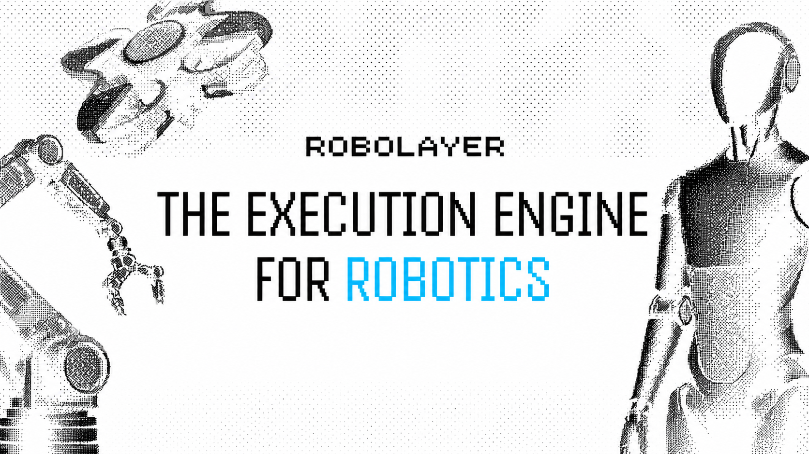

<div align="center">



# Robodyne

**Execution Layer for Robotics & AI Operators on Ethereum**

[](https://ethereum.org)
[](https://soliditylang.org)
[](https://book.getfoundry.sh)
[](https://www.typescriptlang.org)
[](LICENSE)
[](https://github.com/robodynexyz/robodyne/actions/workflows/ci.yml)
[](https://github.com/robodynexyz/robodyne/stargazers)
[](#)
[](#)

[Website](https://robodyne.xyz) · [Docs](docs/architecture.md) · [SDK](sdk/) · [Tokenomics](docs/tokenomics.md)

</div>

---

## $RDY — Token

> **Live on Ethereum mainnet.** Fair launch via Uniswap v3. No presale, no team allocation, no advisor unlocks.

| | |
|---|---|
| **Contract** | `0x0000000000000000000000000000000000000000` *(pinned at launch)* |
| **Network** | Ethereum (ERC-20) |
| **Uniswap** | [app.uniswap.org](https://app.uniswap.org) — RDY/ETH pool |
| **DexScreener** | [dexscreener.com/ethereum](https://dexscreener.com/ethereum) |
| **Etherscan** | [etherscan.io](https://etherscan.io) |
| **35M Locked** | Sablier vesting — team supply, on-chain proof |

**Why locked?** Execution layers need operators with skin in the game, not exit liquidity. Team supply vests on-chain via Sablier — anyone can audit the stream. See [`docs/tokenomics.md`](docs/tokenomics.md) for the full allocation breakdown.

---

## Overview

**Robodyne** is an Ethereum-native execution layer that lets autonomous agents — robotics fleets, AI operators, on-chain bots — register, get assigned work, prove they did it, and earn rewards. All settled on-chain, all economically secured by ETH/$RDY staking.

```
┌─────────────────┐    ┌─────────────────┐    ┌─────────────────┐
│  AI / Robotics  │───▶│    Robodyne     │───▶│    Ethereum     │
│    Operators    │    │  Execution Layer│    │   Settlement    │
└─────────────────┘    └─────────────────┘    └─────────────────┘
        ▲                       │                       │
        │                       ▼                       ▼
        │              ┌─────────────────┐    ┌─────────────────┐
        └──────────────│  Task Assigner  │    │ Reward / Slash  │
                       └─────────────────┘    └─────────────────┘
```

## Why Robodyne

- Fast task assignment — L2-ready (Base, Arbitrum, Optimism)
- Economic security — operators stake ETH / $RDY, slashed on faults
- Verifiable execution — optimistic dispute window + N-of-M consensus (ZK proofs on roadmap)
- Fair reward distribution — speed bonuses, reputation multipliers
- Developer-first SDK — ethers v6, full TypeScript type safety

## Quickstart

### Install SDK
```bash
npm install @robodyne/sdk ethers
# or
yarn add @robodyne/sdk ethers
```

### Submit a task
```typescript
import { Robodyne, parseEther } from "@robodyne/sdk";
import { JsonRpcProvider, Wallet } from "ethers";

const provider = new JsonRpcProvider(process.env.SEPOLIA_RPC_URL);
const signer = new Wallet(process.env.PRIVATE_KEY!, provider);

const robo = new Robodyne({
  network: "sepolia",
  provider,
  signer,
});

const tx = await robo.submitTask({
  payload: "image-classification:cat.jpg",
  reward: parseEther("0.01"),
  timeoutSec: 30,
});
console.log("tx:", tx.hash);
```

### Register as an operator
```typescript
await robo.registerOperator({
  name: "fleet-001",
  capabilities: ["image-classification", "navigation"],
  stake: parseEther("1"), // 1 ETH minimum
});
```

## Architecture

Robodyne is composed of four core on-chain components:

| Component | Purpose |
|-----------|---------|
| **Operator Registry** | Lifecycle, staking, reputation, slashing |
| **Task Engine** | Submission → Assignment → Execution → Verification → Settlement |
| **Verification Layer** | Optimistic dispute window + N-of-M consensus (ZK proofs scaffolded, WIP) |
| **Reward Distribution** | Base reward + speed bonus + reputation multiplier |

Full architecture: [docs/architecture.md](docs/architecture.md)

> **Verification status:** ZK proof verification is a **roadmap item** (Q3 2026). The verifier interface is stubbed in `submitResult` and currently accepts proofs without checking them. Use Optimistic or N-of-M verification for production.

### Contract surface

| Function | Purpose |
|---|---|
| `registerOperator(name, capabilities)` | payable — stake ETH/$RDY, join the registry |
| `submitTask(payloadHash, timeoutSec, mode)` | payable — submit a unit of work with escrowed reward |
| `claimTask(taskId)` | operator claims an unassigned task |
| `submitResult(taskId, resultHash, proof)` | operator posts a result hash + optional proof bytes |
| `finalizeTask(taskId)` | settles the task after the challenge window, pays the operator |
| `slashOperator(op, amount, reason)` | governance-only — burn part of stake on fault |
| `withdrawStake()` | operator exits and reclaims remaining stake |

## $RDY Tokenomics

| | |
|---|---|
| **Total supply** | 1,000,000,000 $RDY |
| **Decimals** | 18 |
| **Network** | Ethereum (ERC-20) |
| **Operator rewards** | 40% — halving emissions over 4y |
| **Ecosystem & grants** | 20% — 12mo cliff, 36mo linear |
| **Team & advisors** | 15% — 12mo cliff, 24mo linear |
| **Liquidity** | 10% — unlocked at TGE |
| **Treasury** | 10% — governance, 48h timelock |
| **Public sale** | 5% — unlocked at TGE |

Full tokenomics: [docs/tokenomics.md](docs/tokenomics.md)

## Build from source

```bash
# Prereqs: Foundry (forge/cast/anvil), Node 20+
# Install Foundry: curl -L https://foundry.paradigm.xyz | bash && foundryup

git clone https://github.com/robodynexyz/robodyne.git
cd robodyne

# Install Solidity deps (OpenZeppelin, forge-std)
forge install OpenZeppelin/openzeppelin-contracts foundry-rs/forge-std

# Build the contracts
forge build

# Run tests
forge test -vv

# Deploy to Sepolia
forge script script/Deploy.s.sol \
  --rpc-url $SEPOLIA_RPC_URL \
  --broadcast --verify
```

### Deployments

| Network | Address |
|---------|---------|
| Sepolia | `0x0000000000000000000000000000000000000000` *(pinned at launch)* |
| Base    | `0x0000000000000000000000000000000000000000` *(pinned at launch)* |
| Mainnet | `0x0000000000000000000000000000000000000000` *(pinned at launch)* |

> Mainnet contract is deployed but unverified — auditing in progress. Use Sepolia for integration testing.

## Roadmap

- [x] Core contract: registry, tasks, staking
- [x] TypeScript SDK (ethers v6)
- [x] Sepolia deployment
- [ ] ZK proof verifier integration
- [ ] Operator dashboard
- [ ] Mainnet launch
- [ ] Cross-chain task routing (LayerZero / CCIP)
- [ ] Hardware attestation (TEE)

## Contributing

PRs welcome. For larger changes, please open an issue first to discuss.

```bash
# Fork → branch → PR
git checkout -b feat/my-thing
# ... make changes
forge test
git commit -m "feat: my thing"
git push origin feat/my-thing
```

## Security

Found a vulnerability? Email **security@robodyne.xyz** with details. Please don't open a public issue.

## License

[MIT](LICENSE) — do whatever, just don't sue us.

---

<div align="center">
<sub>Built on Ethereum</sub>
</div>
<!-- 2026-02-20 :: test: invariant: total stake == sum(operator.stake) -->
<!-- 2026-03-07 :: feat: optional metadata URI per task -->
<!-- 2026-03-18 :: fix(sdk): correct keccak encoding for taskId -->
<!-- 2026-04-02 :: refactor: move VerificationMode enum to interface -->
<!-- 2026-04-21 :: feat(sdk): add typed return for getOperator -->
<!-- 2026-04-25 :: chore: bump dependency pins -->
